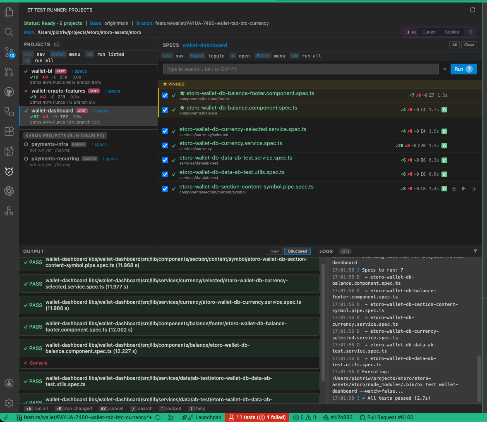
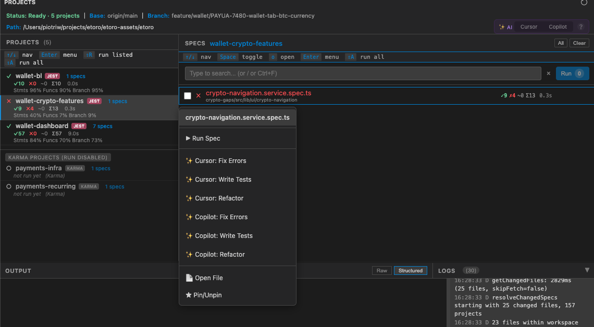

# ET Test Runner

A VS Code/Cursor extension for smart test running in Nx monorepos with Git-based change detection and AI-assisted debugging.



## Quick Install

**Prerequisites:** Node.js 18+ (check with `node -v`)

```bash
# 1. Clone the repo
git clone <repo-url> ~/projects/et-test-runner-vscode
cd ~/projects/et-test-runner-vscode

# 2. Activate Node 18+ (if using nvm)
nvm use 18

# 3. Build and install
./scripts/install.sh

# 4. Restart VS Code/Cursor

# 5. Open your Nx workspace (folder with nx.json)
#    Look for the ET Test Runner icon in the left sidebar
```

**Troubleshooting?** See [docs/INSTALLATION.md](docs/INSTALLATION.md) for detailed instructions.

---

## Features

### Multi-Pane WebView UI
- **Projects Pane** - Browse projects with test metrics, coverage (Stmts/Funcs/Branch), and runner tags (Jest/Karma). Subtle separators between items.
- **Specs Pane** - Select, search, and run specs with inline failure preview. Paths displayed below filenames.
- **Output Pane** - Live test streaming with clickable stack traces (40% height, resizable)
- **Logs Pane** - Side-by-side with Output pane; click header to collapse/expand both, drag separator to resize

### Header Information
The header displays comprehensive status information similar to the console app:
- **Status** - Ready / Running indicator with project count
- **Project** - Currently selected project name
- **Cache** - Number of cached test results
- **Base Branch** - Git base reference for change detection
- **Current Branch** - Your active git branch
- **Workspace Path** - Nx workspace location

### Core Features
- 🔍 **Git-Based Change Detection** - Detects unstaged, staged, and committed changes
- 📊 **Smart Spec Resolution** - Maps source files to their test specs
- ⚡ **Efficient Execution** - Runs specs within a single project (no multi-project runs)
- 💾 **Metrics Caching** - Stores results, durations, and pass/fail counts
- 🤖 **AI-Assisted Debugging** - Integrates with Cursor/GitHub Copilot
- 📈 **Coverage Display** - Shows detailed coverage (Stmts/Funcs/Branch %)
- 🔄 **Auto-Refresh** - Updates on file/git changes
- 🎯 **Auto-Select First Project** - First project is selected on load

### Runner Support
- **Jest** - Full support: run tests, select specs, view metrics
- **Karma** - Limited: view specs, generate missing spec files (run disabled)

### Power User Features
- **Type-to-Search** - Just start typing while in specs pane (no need to focus input)
- **Fuzzy Search** - Type `status:fail` or `change:unstaged` to filter
- **Pinned Specs** - Pin frequently-used specs (★ separated at top)
- **Performance Tracking** - SLOW and FLAKY badges on specs
- **Structured Output** - Default view with real-time updates and clickable test names/files for navigation; accurately resolves file paths from loaded specs
- **Running Overlay** - Shows project name, spec count, and progress during test runs
- **Duplicate Run Prevention** - Cannot start new tests while tests are running
- **Startup Loading Screen** - Shows progress during initialization with status updates
- **Background Loading** - Initial workspace scan runs in background, doesn't block UI
- **Resizable Panes** - Drag separators to adjust pane sizes
- **Help Modal** - Press `?` to see all available shortcuts
- **Jest Testing Rules** - Auto-creates `.cursor/rules/jest-testing.mdc` with AI patterns

---

## Keyboard Shortcuts

Press `?` at any time to see the help modal with all shortcuts.

### Navigation
| Shortcut | Action |
|----------|--------|
| `Tab` | Switch between Projects/Specs panes |
| `↑` / `↓` | Navigate up/down (arrow keys only) |
| `Enter` | Open context menu (both panes) |

### Running Tests
| Shortcut | Action |
|----------|--------|
| `⇧A` / `Shift+A` | Run all specs in current project |
| `⇧R` / `Shift+R` | Run only changed specs (from Projects pane) |

### Specs Pane
| Shortcut | Action |
|----------|--------|
| `Space` | Toggle spec selection |
|| `o` | Open spec file in editor |
| `⌘A` / `Ctrl+A` | Select all specs |
| `⌘L` / `Ctrl+L` | Clear selection |
| `⌘D` / `Ctrl+D` | Pin/Unpin spec |

### Search & Filter
| Shortcut | Action |
|----------|--------|
| `/` or `⌘F` / `Ctrl+F` | Focus search input |
| `Escape` | Clear search |
| Any letter/number | Type-to-search (while in specs pane) |

### Other
| Shortcut | Action |
|----------|--------|
| `⌘X` / `Ctrl+X` | Cancel running test |
| `` ` `` (backtick) | Toggle logs pane |
| `?` | Show help modal |

---

## Search Syntax

| Filter | Example | Description |
|--------|---------|-------------|
| `status:` | `status:fail` | Show only failed/pass/pending |
| `change:` | `change:unstaged` | Filter by git status |
| `name:` | `name:auth` | Fuzzy match on filename |
| Plain text | `service` | Fuzzy match anywhere |

Combine filters: `status:fail change:unstaged`

---

## Configuration

In VS Code settings (`Cmd+,`):

```json
{
  "et-test-runner.baseRef": "origin/main",
  "et-test-runner.coverage": false,
  "et-test-runner.autoRefresh": true,
  "et-test-runner.skipGitFetch": false
}
```

| Setting | Default | Description |
|---------|---------|-------------|
| `baseRef` | `origin/main` | Git ref for change detection |
| `coverage` | `false` | Run with `--coverage` flag |
| `autoRefresh` | `true` | Auto-refresh on file changes |
| `skipGitFetch` | `false` | Skip `git fetch` on refresh (speeds up startup) |
| `verbose` | `false` | Show timing logs for debugging slow operations |

---

## Usage

### 1. Open the Panel
Click the **eToro test icon** in the Activity Bar to open ET Test Runner.

### 2. Select Project
Click a project in the left pane (or first one auto-selects). Projects show:
- Status icon (✓ pass / ✗ fail / ○ not run)
- Project name with runner tag (JEST/KARMA)
- Spec count
- Metrics: `✓12 ✗0 ~2 Σ14` (passed, failed, skipped, total)
- Coverage: `Stmts 96% Funcs 90% Branch 95%`

### 3. Run Tests
- **Single spec**: Press `Ctrl+R` or right-click → Run
- **Multiple specs**: `Space` to select, then click "Run Selected"
- **Current file**: `Ctrl+Shift+R` from any `.ts` file

Note: Run is disabled for Karma projects (only Jest supported).

### 4. AI Assistance



1. **Select AI Target** (optional): Click "Cursor" or "Copilot" pill in the header. Click to select, click again to deselect. Click the `?` icon for help.
2. Press `Enter` on a spec (or click ✨ button) to open the context menu
3. **Choose Action**: Fix Errors, Write Tests, or Refactor
   - If AI target selected: Shows generic commands (e.g., "✨ Fix Errors")
   - If no target selected: Shows specific commands for each AI (e.g., "✨ Cursor: Fix Errors")
4. **Target Files Created**:
   - **Cursor**: Creates `.cursor/rules/jest-testing.mdc` with `@` file references
   - **GitHub Copilot**: Creates `.github/copilot-instructions.md` with Copilot-friendly format
5. Context is generated with:
   - Failing test names and error messages (for Fix action)
   - Related source file references
   - Console output excerpts
   - Jest testing rules (auto-created based on target)
6. Context is copied to clipboard
7. AI chat panel opens automatically (based on target)
8. Press Cmd+V to paste context

**Update Testing Rules**: Run command `ET Test Runner: Update Jest Testing Rules` to refresh the rules template.

**See [docs/AI_USAGE.md](docs/AI_USAGE.md) for detailed AI usage instructions.**

### 5. Resize Panes
- Drag the vertical separator between Projects and Specs panes
- Drag the horizontal separator above the Output pane
- Output pane defaults to 40% height

### 6. Toggle Output/Logs
- Output and Logs are side-by-side in the bottom section
- Click the shared header to collapse/expand the entire bottom section
- Drag the vertical separator between Output and Logs to resize
- Press backtick (`` ` ``) to toggle from keyboard

---

## Requirements

- VS Code 1.85+ or Cursor
- Node.js 18+
- Nx workspace with `nx.json`
- Git repository

---

## Development

### Build from Source

```bash
npm install
npm run build
```

### Run in Debug Mode

1. Open extension folder in VS Code/Cursor
2. Press `F5` to launch Extension Development Host
3. Open your Nx workspace in the new window

### Watch Mode

```bash
npm run watch
```

### Local Installation

```bash
./scripts/install.sh
```

This creates a symlink in your VS Code/Cursor extensions directory.

### Debugging

- **Extension logs**: View → Output → "ET Test Runner"
- **WebView errors**: Developer Tools (Ctrl+Shift+I in Extension Host)
- **TypeScript errors**: Debug Console in original window

---

## Architecture

```
src/
├── extension.ts              # Entry point
├── commands/                 # Command handlers
│   ├── runTests.ts          # Test execution
│   ├── aiAssist.ts          # AI integration
│   ├── createSpec.ts        # Missing spec creation
│   └── refresh.ts           # Workspace refresh
├── webview/                  # WebView UI
│   ├── TestRunnerViewProvider.ts
│   └── getWebviewContent.ts  # HTML/CSS/JS
├── services/                 # Business logic
│   ├── ai/                  # AI context generation
│   ├── coverage/            # Coverage parsing
│   ├── git/                 # Change detection
│   ├── nx/                  # Nx CLI resolution
│   ├── specs/               # Spec resolution
│   ├── workspace/           # Nx workspace detection
│   └── test/                # Jest parsing
├── state/                   # State management
│   ├── workspaceCache.ts    # Test metrics cache
│   ├── uiState.ts           # UI persistence
│   └── runningState.ts      # Running process
├── types/                   # TypeScript types
docs/
├── INSTALLATION.md           # User installation guide
├── TEST_PLAN.md              # Verification test plan
├── AI_USAGE.md               # AI assistance guide
├── AI_CONTEXT.md             # Developer context for AI assistants
└── jest-testing-template.mdc # Jest testing rules template
```

---

## Troubleshooting

### Extension shows "Wrong Workspace"
- This extension is designed for the **etoro-assets** Nx monorepo
- Open the correct workspace folder containing `nx.json`
- The extension checks for `nx.json` in the workspace root or first-level subdirectories

### Extension doesn't activate
- Ensure `nx.json` exists in workspace root or a direct subdirectory
- Check Output → "ET Test Runner" for errors
- Initial load runs in background; WebView shows loading state with progress

### Extension loads slowly
- Set `"et-test-runner.skipGitFetch": true` to skip git fetch (can be slow on large repos)
- Enable `"et-test-runner.verbose": true` to see timing logs in Output channel
- Check if your network is slow (git fetch requires network access)

### No projects shown
- Run `git status` to verify changes exist
- Check `baseRef` setting matches your branch
- Ensure workspace is detected (check header for path)

### Tests not running
- Verify `nx test <project>` works from terminal
- Check Output pane for command errors
- Ensure project uses Jest (Karma projects have run disabled)

### AI assist not opening chat
- Ensure Cursor or GitHub Copilot is installed
- Context is always copied to clipboard as fallback

### Branch not showing
- Ensure you're in a git repository
- Check that `git rev-parse --abbrev-ref HEAD` works

---

## License

MIT

## Contributing

1. Fork the repo
2. Create feature branch
3. Make changes
4. Run `npm run build` to verify
5. Submit PR
